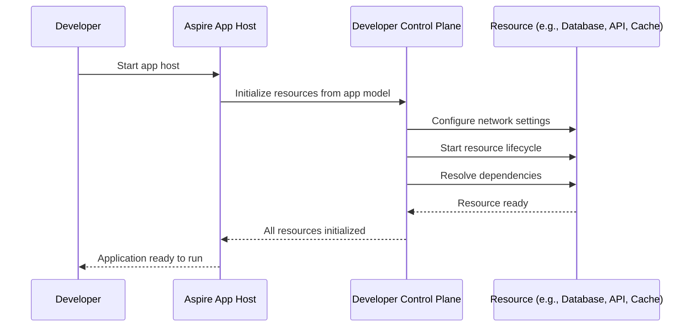

# .NET Aspire architecture overview  

.NET Aspire operates in two primary modes, each tailored to streamline your development and deployment workflows:

- **Run Mode**: This is the default mode designed for local development and testing. When you start the .NET Aspire app host, it orchestrates all resources defined in your [app model](xref:Aspire.Hosting.ApplicationModel.DistributedApplicationModel). This includes setting up correct network configurations, managing resource lifecycles, and ensuring dependencies are ready to go. With a simple <kbd>F5</kbd>, your app host launches all necessary components—services, databases, caches, messaging frameworks, background jobs, APIs, frontend apps, and more—fully configured and ready to run.

- **Publish Mode**: In this mode, the .NET Aspire app host focuses on generating publish artifacts. These artifacts are tailored for your target environments, enabling seamless deployment. The specific output depends on the publisher being used, ensuring flexibility for various deployment scenarios.

Both modes leverage a robust set of familiar APIs and a rich ecosystem of [integrations](../fundamentals/integrations-overview.md). These integrations work together like puzzle pieces, enabling you to define resources, express dependencies, and configure behavior effortlessly—whether you're running locally or deploying to production.

## Dev-time orchestration

In run mode, the .NET Aspire app host orchestrates all resources defined in your app model. While there's [content on what APIs exist and how to use them](../fundamentals/app-host-overview.md), instead this content is focused on how these things works under the hood. How do container resources get started? How are network configurations applied? What's responsible for managing the lifecycle of resources? How are dependencies resolved? These are the types of questions that this content will answer.

### Developer Control Plane

The Developer Control Plane (DCP) is the core of the .NET Aspire app host. It orchestrates all resources defined in your app model, ensuring that everything is set up correctly for local development and testing. The DCP manages the lifecycle of resources, applies network configurations, and resolves dependencies, allowing you to focus on building your application without worrying about the underlying infrastructure.

When the app host runs, it passes the app model to DCP. DCP then evaluates the collection of resources defined within the app model and performs the following tasks:

- Prepares the resources for execution:
  - Services have their endpoints configured.
  - 

### Developer dashboard

...
