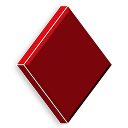

:::row:::
:::column:::

:::column-end:::
:::column span="3":::

[Garnet](https://microsoft.github.io/garnet/) is a a high-performance cache-store from Microsoft Research and complies with the [Redis serialization protocol](../stackexchange-redis-caching-overview.md#redis-serialization-protocol-resp) (RESP). The .NET Aspire Redis integration enables you to connect to existing Garnet instances, or create new instances from .NET with the [`ghcr.io/microsoft/garnet` container image](https://github.com/microsoft/garnet/pkgs/container/garnet).

:::column-end:::
:::row-end:::
