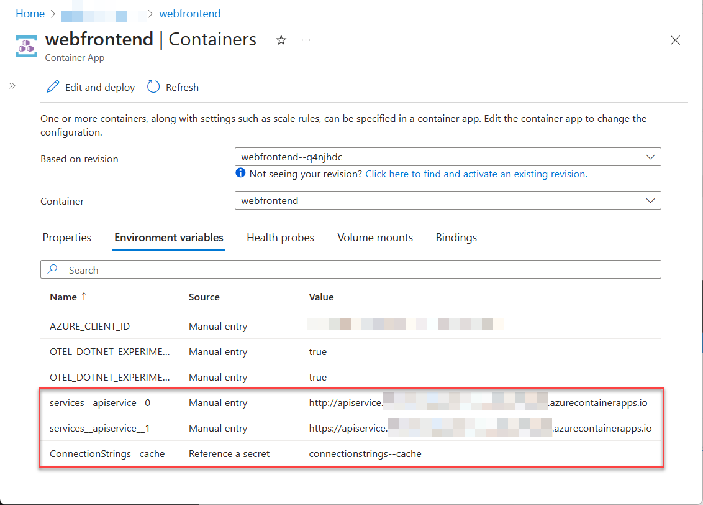
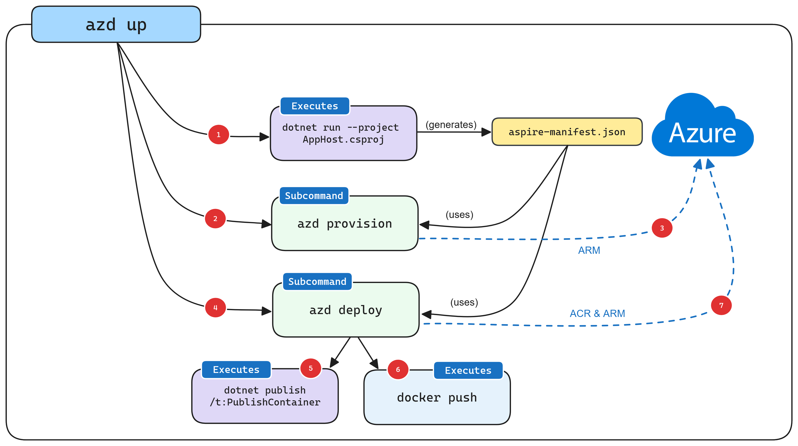

# Deploying .NET Aspire apps using AZD (in depth guide)

The Azure Developer CLI (AZD) has been extended to support deploying .NET Aspire
applications. Use this guide to walk through the process of creating and deploying
a .NET Aspire application to Azure Container Apps using the Azure Developer CLI.

## Creating .NET Aspire application from starter template

The first step is to create a new .NET Aspire application. In this example the
`dotnet new` command is being used, although you can create the project Visual
Studio as well.

```dotnetcli
dotnet new aspire-starter --use-redis-cache -o AspireAzdWalkthrough
cd AspireAzdWalkthrough
dotnet run --project AspireAzdWalkthrough.AppHost\AspireAzdWalkthrough.AppHost.csproj
```

The previous commands will create a new .NET Aspire application based on the `aspire-starter`
template which includes a dependency on Redis cache. It then runs the Aspire project which
verifies that everything is working correctly.

## Initialzing AZD

Before deploying a .NET Aspire application with AZD, the repository/path containing the app
needs to be initialized. To download AZD refer to: [Install or update the Azure Developer CLI](/azure/developer/azure-developer-cli/install-azd).

```azurecli
azd init
```

AZD will prompt on whether you want to use code in the current directory or select a template,
in this case select the "Use code in the current directory" option.


After scanning, AZD will prompt to confirm that it found the correct .NET project containing
the .NET Aspire applications AppHost code. After checking the path select the "Confirm and
continue initializing my app".


Once the path to the AppHost is confirmed AZD will analyze the .NET Aspire app model defined
in the AppHost and prompt which of the projects referenced in the app model should be exposed
via a public endpoint. For the starter application template only the `webfrontend` should be
exposed on a public endpoint.


The final step in initializing AZD to work with the .NET Aspire code base is to select an
environment name. The environment forms part of an Azure resource-group name when deploying
the .NET Aspire application. For now select the name **aspireazddev**.


After providing the environment name AZD will generate a number of files and place them
into the working directory. These files are:

- `azure.yaml`; this file tell AZD where to find the .NET Aspire AppHost project.
- `.azure\config.json`; configuration file that tells AZD what the current active environment is.
- `.azure\aspireazddev\.env`; this file contains environment specific overrides.
- `.azure\aspireazddev\config.json`; configuration file that tells AZD which services should have a public endpoint in this environment.

The `azure.yaml` file has the following contents:

```yml
# yaml-language-server: $schema=https://raw.githubusercontent.com/Azure/azure-dev/main/schemas/v1.0/azure.yaml.json

name: AspireAzdWalkthrough
services:  
  app:
    language: dotnet
    project: .\AspireAzdWalkthrough.AppHost\AspireAzdWalkthrough.AppHost.csproj
    host: containerapp
```

Because the `project` field is pointing to a .NET Aspire AppHost project, AZD will
activate its integration with .NET Aspire and derive the required infrastructure
needed to host this appication from the application model specified in the `Program.cs`
file of the .NET Aspire app.

The `.azure\aspireazddev\config.json` file has the following contents:

```json
{
  "services": {
    "app": {
      "config": {
        "exposedServices": [
          "webfrontend"
        ]
      }
    }
  }
}
```

This file is how AZD remembers (on a per environment basis) which services should be
exposed with a public endpoint. AZD can be configured to support multiple environments

## Initial deployment

In order to deploy the .NET Aspire application to Azure AZD will need to get authorization
to call the Azure resource management APIs.

```azurecli
azd auth login
```

The previous command will launch a browser to authenticate the command-line session. Once
authenticated use the following command to provision and deploy the application.

```dotnetcli
azd up
```

Before deploying the application AZD needs to know which subscription and location the
resources should be deployed. Once these options are selected the .NET Aspire application
will be deployed.


The final line of output from the AZD command is a link to the Azure Portal that shows
all of the Azure resources that were deployed:


Note that there are three containers deployed within this application. These are:

- `webfrontend`; contains code from the web project in the starter template.
- `apiservice`; contains code from the API service project in the starter template.
- `cache`; running a Redis container image to supply a cache to the front-end.

Just like in local development, the configuration of connection strings has been handled
automatically. In this case AZD was responsible for interpretting the application model
and translating it to the appropriate deployment steps. As an example here is the connection
string and service discovery variables that were injected into the `webfrontend` container
so that it knows how to connect to the Redis cache and `apiservice`.



For more information on how .NET Aspire apps handle connection strings and service discovery
refer to: [.NET Aspire orchestration overview](../../app-host-overview.md).

## Deploying application updates

When the `azd up` command is executed the underlying Azure resources are _provisioned_ and
a container image is built and _deployed_ to the container apps hosting the .NET aspire
application. Typically once development is underway and Azure resources are deployed it won't
be necessary to provision Azure resources every time code is updated - this is expecially true
for the developer inner loop.

To speed up deployment of code changes AZD supports deploying code updates in the container
image. This can be done using the AZD deploy command.

```azurecli
azd deploy
```


It is not necessary to deploy all services each time. Because AZD understands the .NET Aspire
application model it is possible to deploy just one of the services specified using the
following command.

```azurecli
azd deploy webfrontend
```

## Deploying infrastructure updates

Whenever the dependency structure within a .NET Aspire application changes, AZD will need to
be used to re-provision the underlying Azure resources. The `azd provision` command can be used
to apply these changes to the infrastructure.

To see this in action update the `Program.cs` file in the AppHost project to the following:

```csharp
var builder = DistributedApplication.CreateBuilder(args);

var cache = builder.AddRedisContainer("cache");

var locationsdb = builder.AddPostgresContainer("db").AddDatabase("locations"); // Added!
var apiservice = builder.AddProject<Projects.AspireAzdWalkthrough_ApiService>("apiservice")
    .WithReference(locationsdb); // Added!

builder.AddProject<Projects.AspireAzdWalkthrough_Web>("webfrontend")
    .WithReference(cache)
    .WithReference(apiservice);

builder.Build().Run();
```

Save the file and issue the following command:

```azurecli
azd provision
```

This command will update the infrastructure by creating a container app to host the
Postgres database. Note that the `azd provsion` command did not update the connection
strings for the `apiservice` container. In order to have connection strings updated
to point to the newly provisioned Postgres database the `azd deploy` command should
be invoked again. When in doubt use `azd up` to both provision and deploy.

## Cleaning up

Remember to clean up the Azure resources that have been created during this
walkthrough. Because AZD knows the resource group in which it created the resources
it can be used to spin down the environment using the following command.

```azurecli
azd down
```

The previous command may take some time to execute, but when completed the resource
group and contained resources should be deleted.


## How AZD integration works

The following diagram illustrates conceptually how AZD and .NET Aspire are integrated:



1. When AZD targets an .NET Aspire application it starts the AppHost with a special command (`dotnet run --project AppHost.csproj -- --publisher manifest`), this produces the Aspire manifest file. For more information on the Aspire manifest file format see: [.NET Aspire manifest format for deployment tool builders](../manifest-format.md).
1. The Aspire manifest file is interrogated by AZD's `provision` sub-command logic to generate Bicep files (in memory).
1. After generating the Bicep files, a deployment is triggered using Azure's ARM APIs targetting the subscription and resource group providied earlier.
1. Once the underlying Azure resources are configured the `deploy` sub-command logic is executed which uses the same Aspire manifest file.
1. As part of deployment AZD calls out to `dotnet publish` using .NET's built in container publishing support to generate container images.
1. Once AZD has built the container images it pushes them to the ACR registry that was created during the provisioning phase.
1. Finally, once the container image is in ACR, AZD updates the resource using ARM to start using the new version of the container image.

## Generating Bicep from .NET Aspire app model using AZD

Although development teams are free to use `azd up` (or `azd provision` and `azd deploy`) commands for their deployments both for development and production
purposes, some teams may choose to generate Bicep files that they can review and manage as part of version control (this also allows these
Bicep files to be referenced as part of a larger more complex Azure deployment).

AZD includes the ability to output the Bicep it uses for provisioning via following command:

```azurecli
azd config set alpha.infraSynth on
azd infra synth
```

After this command is executed in the starter template example used in this guide, the following files are created:

- `infra\main.bicep`; the main entry point for the deployment.
- `infra\main.parameters.json`; parameters file for main Bicep (maps to environment variabes defined in `.azure` folder).
- `infra\resoures.bicep`; defines the Azure resources required to support the .NET Aspire app model.
- `AspireAzdWalkthrough.Web\manifests\containerApp.tmpl.yaml`; container app definition for `webfrontend`.
- `AspireAzdWalkthrough.ApiService\manifests\containerApp.tmpl.yaml`; container app definition for `apiservice`.

Notice that the `infra\resources.bicep` file does not contain any defintion of the container apps themselves (with the exception
of container apps which are dependencies such as Redis and Postgres):

```bicep
@description('The location used for all deployed resources')
param location string = resourceGroup().location

@description('Tags that will be applied to all resources')
param tags object = {}

var resourceToken = uniqueString(resourceGroup().id)

resource managedIdentity 'Microsoft.ManagedIdentity/userAssignedIdentities@2023-01-31' = {
  name: 'mi-${resourceToken}'
  location: location
  tags: tags
}

resource containerRegistry 'Microsoft.ContainerRegistry/registries@2023-07-01' = {
  name: replace('acr-${resourceToken}', '-', '')
  location: location
  sku: {
    name: 'Basic'
  }
  tags: tags
}

resource caeMiRoleAssignment 'Microsoft.Authorization/roleAssignments@2022-04-01' = {
  name: guid(containerRegistry.id, managedIdentity.id, subscriptionResourceId('Microsoft.Authorization/roleDefinitions', '7f951dda-4ed3-4680-a7ca-43fe172d538d'))
  scope: containerRegistry
  properties: {
    principalId: managedIdentity.properties.principalId
    principalType: 'ServicePrincipal'
    roleDefinitionId:  subscriptionResourceId('Microsoft.Authorization/roleDefinitions', '7f951dda-4ed3-4680-a7ca-43fe172d538d')
  }
}

resource logAnalyticsWorkspace 'Microsoft.OperationalInsights/workspaces@2022-10-01' = {
  name: 'law-${resourceToken}'
  location: location
  properties: {
    sku: {
      name: 'PerGB2018'
    }
  }
  tags: tags
}

resource containerAppEnvironment 'Microsoft.App/managedEnvironments@2023-05-01' = {
  name: 'cae-${resourceToken}'
  location: location
  properties: {
    appLogsConfiguration: {
      destination: 'log-analytics'
      logAnalyticsConfiguration: {
        customerId: logAnalyticsWorkspace.properties.customerId
        sharedKey: logAnalyticsWorkspace.listKeys().primarySharedKey
      }
    }
  }
  tags: tags
}

resource cache 'Microsoft.App/containerApps@2023-05-02-preview' = {
  name: 'cache'
  location: location
  properties: {
    environmentId: containerAppEnvironment.id
    configuration: {
      service: {
        type: 'redis'
      }
    }
    template: {
      containers: [
        {
          image: 'redis'
          name: 'redis'
        }
      ]
    }
  }
  tags: union(tags, {'aspire-resource-name': 'cache'})
}

resource locations 'Microsoft.App/containerApps@2023-05-02-preview' = {
  name: 'locations'
  location: location
  properties: {
    environmentId: containerAppEnvironment.id
    configuration: {
      service: {
        type: 'postgres'
      }
    }
    template: {
      containers: [
        {
          image: 'postgres'
          name: 'postgres'
        }
      ]
    }
  }
  tags: union(tags, {'aspire-resource-name': 'locations'})
}
output MANAGED_IDENTITY_CLIENT_ID string = managedIdentity.properties.clientId
output AZURE_CONTAINER_REGISTRY_ENDPOINT string = containerRegistry.properties.loginServer
output AZURE_CONTAINER_REGISTRY_MANAGED_IDENTITY_ID string = managedIdentity.id
output AZURE_CONTAINER_APPS_ENVIRONMENT_ID string = containerAppEnvironment.id
output AZURE_CONTAINER_APPS_ENVIRONMENT_DEFAULT_DOMAIN string = containerAppEnvironment.properties.defaultDomain
```

For more information on using Bicep automate deployments to Azure see: [What is Bicep?](/azure/azure-resource-manager/bicep/overview?tabs=bicep)

The definition of the container apps from the .NET service projects is contained within the `containerApp/tmpl.yaml`
files in the `manifests` directory in each project respectively. Here is an example from the `webfrontend` project:

```yml
location: {{ .Env.AZURE_LOCATION }}
identity:
  type: UserAssigned
  userAssignedIdentities:
    ? "{{ .Env.AZURE_CONTAINER_REGISTRY_MANAGED_IDENTITY_ID }}"
    : {}
properties:
  environmentId: {{ .Env.AZURE_CONTAINER_APPS_ENVIRONMENT_ID }}
  configuration:
    activeRevisionsMode: single
    ingress:
      external: true
      targetPort: 8080
      transport: http
      allowInsecure: false
    registries:
    - server: {{ .Env.AZURE_CONTAINER_REGISTRY_ENDPOINT }}
      identity: {{ .Env.AZURE_CONTAINER_REGISTRY_MANAGED_IDENTITY_ID }}
  template:
    containers:
    - image: {{ .Env.SERVICE_WEBFRONTEND_IMAGE_NAME }}
      name: webfrontend
      env:
      - name: AZURE_CLIENT_ID
        value: {{ .Env.MANAGED_IDENTITY_CLIENT_ID }}
      - name: ConnectionStrings__cache
        value: {{ connectionString "cache" }}
      - name: OTEL_DOTNET_EXPERIMENTAL_OTLP_EMIT_EVENT_LOG_ATTRIBUTES
        value: "true"
      - name: OTEL_DOTNET_EXPERIMENTAL_OTLP_EMIT_EXCEPTION_LOG_ATTRIBUTES
        value: "true"
      - name: services__apiservice__0
        value: http://apiservice.internal.{{ .Env.AZURE_CONTAINER_APPS_ENVIRONMENT_DEFAULT_DOMAIN }}
      - name: services__apiservice__1
        value: https://apiservice.internal.{{ .Env.AZURE_CONTAINER_APPS_ENVIRONMENT_DEFAULT_DOMAIN }}
tags:
  azd-service-name: webfrontend
  aspire-resource-name: webfrontend
```

After executing the `azd infra synth` command, when `azd provision` and `azd deploy` are used it will
use the Bicep and supporting files generated above. Note that if `azd infra synth` is executed again
it will replace any modified files with freshly generated ones (with a confirmation prompt).

## Working in teams

Because AZD makes it easy to provision new environments, it is possible for each team member to have an
isolated cloud-hosted environment for debugging code in a setting that closely matches production. When
doing this each team member should create their own environment using the following command:

```azurecli
azd env new
```

This will prompt the user for subscription and resource group information again and subsequent `azd up`,
`azd provision`, and `azd deploy` invocations will use this new environment by default. The `--environment`
switch can be applied to these commands to switch between environments.
