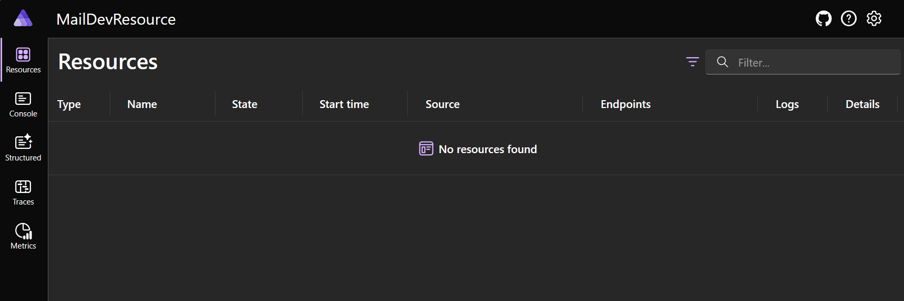
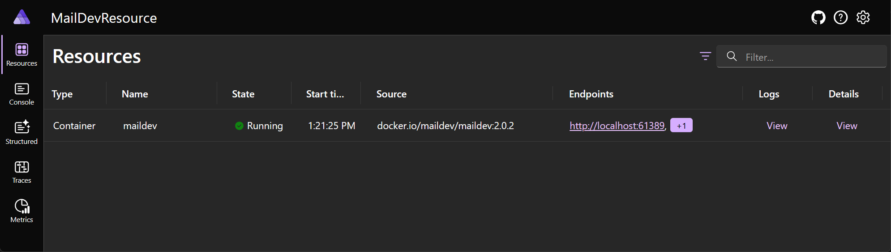
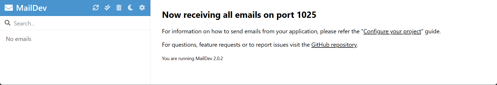
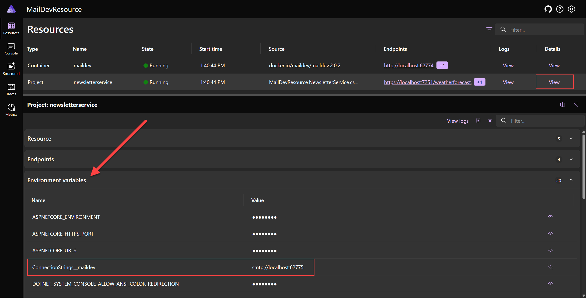

# Create custom resource types for .NET Aspire

.NET Aspire improves the development experience by providing reusable building blocks that can be used to quickly arrange application dependencies and expose them to your own code. One of the key building blocks of an Aspire-based application is the _resource_. Consider the code below:

```csharp
var builder = DistributedApplication.CreateBuilder(args);
var redis = builder.AddRedis("cache");
var db = builder.AddPostgres("pgserver").AddDatabase("inventorydb");
builder.AddProject<Projects.InventoryService>("inventoryservice")
       .WithReference(redis)
       .WithReference(db);
```

In the code above there four (4) resources represented:

1. "cache"; a Redis container
2. "pgserver"; a Postgres container
3. "inventorydb"; a database hosted on "pgserver"
4. "inventoryservice"; an ASP.NET Core application

Most Aspire-related code that the average developer will write will center around adding resources to the application model and creating references between them.

## Key elements of a .NET Aspire custom resource

Building a custom resource in .NET Aspire requires the following:

1. A custom resource type that implements <xref:Aspire.Hosting.ApplicationModel.IResource>
2. An extension method for <xref:Aspire.Hosting.IDistributedApplicationBuilder> named `AddXYZ` where XYZ is the name of the custom resource.

Optionally if the resource requires optional configuration custom resource developers may wish to implement `With...` suffixed extension methods to make these configuration options discoverable using the builder pattern.

## Example: MailDev

To help understand how to develop custom resources, this article will show an example of how to build a custom resource for _MailDev_. MailDev is an open-source tool which provides a local mail server specifically designed to allow developers to test e-mail sending behaviors within their application. You can learn more about the tool at [the MailDev GitHub repository](https://github.com/maildev/maildev).

In this example we will create a new .NET Aspire application as a test environment for the MailDev resource that we will create. While you can create custom resources in existing Aspire applications it is a good idea to consider whether the custom resource might be used across multiple .NET Aspire-based solutions and should be developed as a reusable component.

## Step 1: Setup starter project

Create a new .NET Aspire application that will be used to test out the new resource that we are developing.

```dotnetcli
dotnet new aspire -o MailDevResource
cd MailDevResource
dir
```

Once the project is created you should a listing containing the following:

- `MailDevResource.AppHost`; a AppHost used to test out the custom resource.
- `MailDevResource.ServiceDefaults`; service defaults project to be used in service projects.
- `MailDevResource.sln`; solution file referencing both projects above.

Verify that the project can build and run successfully by executing the following command:

```dotnetcli
dotnet run --project MailDevResource.AppHost/MailDevResource.AppHost.csproj
```

The console output should look similar to the following:

```dotnetcli
Building...
info: Aspire.Hosting.DistributedApplication[0]
      Aspire version: 8.0.0-preview.7.24224.7+147c1d2cccdff3b185517a85f095ba590608500c
info: Aspire.Hosting.DistributedApplication[0]
      Distributed application starting.
info: Aspire.Hosting.DistributedApplication[0]
      Application host directory is: C:\Code\MailDevTutorial\MailDevResource\MailDevResource.AppHost
info: Aspire.Hosting.DistributedApplication[0]
      Now listening on: https://localhost:17297
info: Aspire.Hosting.DistributedApplication[0]
      Login to the dashboard at https://localhost:17297/login?t=f6104b597046542abe63c6d7cb1a7709
info: Aspire.Hosting.DistributedApplication[0]
      Distributed application started. Press Ctrl+C to shut down.
```

Open the dashboard link in the browser and the dashboard:



Press `CTRL-C` to shutdown the application (you can close the browser tab).

## Step 2: Creating library for resource extension

.NET Aspire resources are just classes and methods contained within a class library that references the .NET Aspire Hosting library (`Aspire.Hosting`). By placing the resource in a separate project you can more easily share it between .NET Aspire-based applications and potentially package it and share it on NuGet.

```dotnetcli
# Create the class library.
dotnet new classlib -o MailDev.Hosting

# Add Aspire.Hosting to the class library as a package reference.
dotnet add .\MailDev.Hosting\MailDev.Hosting.csproj package Aspire.Hosting --version 8.0.0

# Add class library reference to the AppHost project
dotnet add .\MailDevResource.AppHost\MailDevResource.AppHost.csproj reference .\MailDev.Hosting\MailDev.Hosting.csproj

# Add class library project to the solution file.
dotnet sln .\MailDevResource.sln add .\MailDev.Hosting\MailDev.Hosting.csproj
```

Once the following steps are performed you can launch the project:

```dotnetcli
dotnet run --project .\MailDevResource.AppHost\MailDevResource.AppHost.csproj   
```

This will result in a warning being displayed to the console:

```dotnetcli
C:\Code\MailDevTutorial\packages\nuget\aspire.hosting.apphost\8.0.0\build\Aspire.Hosting.AppHost.targets(174,5): warning ASPIRE004: '..\MailDev.Hosting\MailDev.Hosting.csproj' is referenced by an Aspire Host project, but it is not an executable. Did you mean to set IsAspireProjectResource="false"? [C:\Code\MailDevTutorial\MailDevResource\MailDevResource.AppHost\MailDevResource.AppHost.csproj]
```

This is because .NET Aspire treats project references in the AppHost project as if they are service projects. To tell .NET Aspire that the project reference should be treated as a non-service project modify the `MailDevResource.AppHost\MailDevResource.AppHost.csproj` files reference to the `MailDev.Hosting` project to be the following:

```xml
<ItemGroup>
  <!-- The IsAspireProjectResource attribute tells .NET Aspire to treat this reference as a standard
       project reference and not attempt to generate a metadata file -->
  <ProjectReference Include="..\MailDev.Hosting\MailDev.Hosting.csproj" IsAspireProjectResource="false" />
</ItemGroup>
```

Launching the AppHost project should now not cause any warnings to be displayed.

## Step 3: Defining resource types

The class library `MailDev.Hosting` that was added to the solution is the container for the resource type and extension method. It is a good idea to first thinking about the experience that you want to give developers when using your custom resource. In the case of this custom resource we would want developers to be able to write code like the following:

```csharp
var builder = DistributedApplication.CreateBuilder(args);
var maildev = builder.AddMailDev("maildev");
builder.AddProject<Projects.NewsletterService>("newsletterservice")
       .WithReference(maildev);
```

To achieve this we need a custom resource named `MailDevResource` which implements <xref:Aspire.Hosting.ApplicationModel.IResourceWithConnectionString> so that we can use it with <xref:Aspire.Hosting.ResourceBuilderExtensions.WithReference%2A> extension to inject the connection details for the MailDev server as a connection string.

MailDev is available as a container resource, so we will also want to derive from <xref:Aspire.Hosting.ApplicationModel.ContainerResource> so that we can make use of various pre-existing container-focused extensions in .NET Aspire.

Add the following source to `MailDevResource.cs` in the `MailDev.Hosting` package.The code below is the custom resource type. Refer to the comments in the source listing for details on each relevant line of code.

```csharp
// File: MailDevResource.cs

// For ease of discovery, resource types should be placed in
// the Aspire.Hosting.ApplicationModel namespace. If there is
// likelihood of a conflict on the resource name consider using
// an alternative namespace.
namespace Aspire.Hosting.ApplicationModel;

public class MailDevResource(string name) : ContainerResource(name), IResourceWithConnectionString
{
    // Constants used to refer to well known-endpoint names, this is specific
    // for each resource type. MailDev exposes an SMTP endpoint and a HTTP
    // endpoint.
    internal const string SmtpEndpointName = "smtp";
    internal const string HttpEndpointName = "http";

    // An EndpointReference is a core .NET Aspire type used for keeping
    // track of endpoint details in expressions. Simple literal values cannot
    // be used because endpoints are not known until containers are launched.
    private EndpointReference? _smtpReference;
    public EndpointReference SmtpEndpoint => _smtpReference ??= new(this, SmtpEndpointName);

    // Required property on IResourceWithConnectionString. Represents a connection
    // string that applications can use to access the MailDev server. In this case
    // the connection string is composed of the SmtpEndpoint endpoint reference.
    public ReferenceExpression ConnectionStringExpression => ReferenceExpression.Create(
        $"smtp://{SmtpEndpoint.Property(EndpointProperty.Host)}:{SmtpEndpoint.Property(EndpointProperty.Port)}"
        );
}
```

<xref:Aspire.Hosting.ApplicationModel.EndpointReference> and <xref:Aspire.Hosting.ApplicationModel.ReferenceExpression> are examples of several types which implement a collection of interfaces such as <xref:Aspire.Hosting.ApplicationModel.IManifestExpressionProvider>, <xref:Aspire.Hosting.ApplicationModel.IValueProvider>, and <xref:Aspire.Hosting.ApplicationModel.IValueWithReferences>. To learn more about these types in their role in .NET Aspire see the [technical details](#technical-details) section at the end of this article.

## Step 4: Defining resource extensions

To make it easy for developers to use the custom resource an extension method named `AddMailDev(...)` needs to be added to the `MailDev.Hosting` package. The `AddMailDev(...)` extension method is responsible for configuring the resource so it can start successfully as a container.

Add the following code to the `MailDevExtensions.cs` file in the `MailDev.Hosting` project:

```csharp
using Aspire.Hosting.ApplicationModel;

// Put extensions in the Aspire.Hosting namespace to ease discovery as referencing
// the .NET Aspire hosting package automatically adds this namespace.
namespace Aspire.Hosting;

public static class MailDevResourceBuilderExtensions
{
    public static IResourceBuilder<MailDevResource> AddMailDev(this IDistributedApplicationBuilder builder, string name, int? httpPort = null, int? smtpPort = null)
    {
        // The AddResource method is a core API within .NET Aspire and is
        // used by resource developers to wrap a custom resource in an
        // IResourceBuilder<T> instance. Extension methods to customize
        // the resource (if any exist) target the builder interface.
        var resource = new MailDevResource(name);
        return builder.AddResource(resource)
                      .WithImage(MailDevContainerImageTags.Image)
                      .WithImageRegistry(MailDevContainerImageTags.Registry)
                      .WithImageTag(MailDevContainerImageTags.Tag)
                      .WithHttpEndpoint(targetPort: 1080, port: httpPort, name: MailDevResource.HttpEndpointName)
                      .WithEndpoint(targetPort: 1025, port: smtpPort, name: MailDevResource.SmtpEndpointName);
    }
}

// This class just contains constant strings that can be updated periodically
// when new versions of the underlying container are released.
internal static class MailDevContainerImageTags
{
    public const string Registry = "docker.io";
    public const string Image = "maildev/maildev";
    public const string Tag = "2.0.2";
}
```

## Step 5: Validate custom component inside the AppHost

Now that the basic structure for the custom resource is complete it is time to test it in a real AppHost project. Open the `Program.cs` file in the `MailDevResource.AppHost` project and update it with the following code:

```csharp
var builder = DistributedApplication.CreateBuilder(args);
var maildev = builder.AddMailDev("maildev");

builder.Build().Run();
```

After updating the `Program.cs` file launch the app host project and open the dashboard:

```dotnetcli
dotnet run --project .\MailDevResource.AppHost\MailDevResource.AppHost.csproj   
```

After a few moments the dashboard will show that the `maildev` resource is running and a hyperlink will be available to click which navigates to the MailDev web app which shows the content of each e-mail that your application sends.





## Step 6: Adding a .NET service project to the AppHost for testing

Once .NET Aspire can successfully launch the MailDev component it is time to consume the connection information for MailDev within a .NET project. In .NET Aspire it is common for there to be a _hosting package_ and one or more _component packages_. For example we have `Aspire.Hosting.Redis` (the hosting package) and `Aspire.StackExchange.Redis`, `Aspire.StackExchange.Redis.DistributedCaching`, and `Aspire.StackExchange.Redis.OutputCaching` (component packages).

In the case of this resource, the .NET platform already has an SMTP client in the form of <xref:System.Net.Mail.SmtpClient>. In this example we will use this existing API for the sake of simplicity although other resource types may benefit from custom component libraries to assist developers.

In order to test the end to end scenario we will need a .NET project which we can inject the connection information into for the MailDev resource. Add a web api project

```dotnetcli
# Creates a ASP.NET Core project that uses minimal APIs.
dotnet new webapi --use-minimal-apis --no-openapi -o MailDevResource.NewsletterService

# Add the newsletter service project as a reference to the app host.
dotnet add .\MailDevResource.AppHost\MailDevResource.AppHost.csproj reference .\MailDevResource.NewsletterService\MailDevResource.NewsletterService.csproj

# Add the newsletter service project to the solution
dotnet sln .\MailDevResource.sln add .\MailDevResource.NewsletterService\MailDevResource.NewsletterService.csproj
```

Inside the `Program.cs` in the `MailDevResource.AppHost` project, update the source file to look like the following:

```csharp
var builder = DistributedApplication.CreateBuilder(args);
var maildev = builder.AddMailDev("maildev");
builder.AddProject<Projects.MailDevResource_NewsletterService>("newsletterservice")
       .WithReference(maildev);

builder.Build().Run();
```

After updating the `Program.cs` source file launch the AppHost again and verify that the .NET project that was added started and that the environment variable `ConnectionStrings__maildev` was added to the process (click on the _Details_ link on the `newsletterservice` row in the dashboard).



## Step 7: Use connection string to send message.

To use the SMTP connection details that were injected into the newsletter service project we will inject an instance of <xref:System.Net.Mail.SmtpClient> into the dependency injection container as a singleton. Add the following code to the `Program.cs` file in the `MailDevResource.NewsletterService` project to setup the singleton service.

```csharp
builder.Services.AddSingleton<SmtpClient>((sp) =>
{
    var smtpUri = new Uri(builder.Configuration.GetConnectionString("maildev")!);
    var smtpClient = new SmtpClient(smtpUri.Host, smtpUri.Port);
    return smtpClient;
});
```

To test the client we will add two simple subscribe and unsubscribe GET methods to the newsletter service. Add the following code to the `Program.cs` file in the `MailDevResource.NewsletterService` project to setup the ASP.NET Core routes:

```csharp
app.MapGet("/subscribe", async (SmtpClient smtpClient, string email) =>
{
    using var message = new MailMessage("newsletter@yourcompany.com", email);
    message.Subject = "Welcome to our newsletter!";
    message.Body = "Thank you for subscribing to our newsletter!";
    await smtpClient.SendMailAsync(message);
});

app.MapGet("/unsubscribe", async (SmtpClient smtpClient, string email) =>
{
    using var message = new MailMessage("newsletter@yourcompany.com", email);
    message.Subject = "You are unsubscribed from our newsletter!";
    message.Body = "Sorry to see you go. We hope you will come back soon!";
    
    await smtpClient.SendMailAsync(message);
});
```

Once the _Program.cs_ file is updated launch the app host and use your browser, or `curl` to hit the following URLs:

```bash
# Remember to replace the port to match your local environment.
curl https://localhost:7289/subscribe?email=test@test.com
curl https://localhost:7289/unsubscribe?email=test@test.com
```

If those API calls return a successful response then you should be able to click on the `maildev` resource the dashboard and the MailDev UI will show the emails that have been sent to the SMTP endpoint.


## Technical details

### `ReferenceExpression` and `EndpointReference`

In the code above the `MailDevResource` had two properties. `SmtpEndpoint` and `ConnectionStringExpression`. The types of these properties were <xref:Aspire.Hosting.ApplicationModel.EndpointReference> and <xref:Aspire.Hosting.ApplicationModel.ReferenceExpression> respectively. These types are among several which are used throughout .NET Aspire to represent configuration data which is not finalized until the .NET Aspire application is either run or published to the cloud via a tool such as `azd` (Azure Developer CLI).

The fundamental problem that these types help solve is deferring resolution of concrete configuration information until _all_ of the information is available.

For example, in the `MailDevResource` example we expose a property called `ConnectionStringExpression` as required by the <xref:Aspire.Hosting.ApplicationModel.IResourceWithConnectionString> interface. The type of the property is <xref:Aspire.Hosting.ApplicationModel.ReferenceExpression> and is created by passing in an interpolated string to the <xref:Aspire.Hosting.ApplicationModel.ReferenceExpression.Create%2A> method.

```csharp
public ReferenceExpression ConnectionStringExpression => ReferenceExpression.Create(
        $"smtp://{SmtpEndpoint.Property(EndpointProperty.Host)}:{SmtpEndpoint.Property(EndpointProperty.Port)}"
        );
```

The signature for the <xref:Aspire.Hosting.ApplicationModel.ReferenceExpression.Create%2A> method is as follows:

```csharp
public static ReferenceExpression Create(in ExpressionInterpolatedStringHandler handler)
```

Notice that this is not a regular <xref:System.String> argument. Method makes use of the [interpolated string handler pattern](/dotnet/csharp/whats-new/tutorials/interpolated-string-handler) in .NET to capture the interpolated string template and the values referenced within it to allow for custom processing. In the case of .NET Aspire we capture these details in a <xref:Aspire.Hosting.ApplicationModel.ReferenceExpression> which can be evaluated as each value referenced in the interpolated string becomes available.

Here is how the flow of execution works:

1. Resource which implements <xref:Aspire.Hosting.ApplicationModel.IResourceWithConnectionString> is added to the model (e.g. `AddMailDev(...)`).
2. `IResourceBuilder<MailDevResource>` is passed to the <xref:Aspire.Hosting.ResourceBuilderExtensions.WithReference%2A> which has a special overload which handles <xref:Aspire.Hosting.ApplicationModel.IResourceWithConnectionString> implementors.
3. `WithReference` wraps the resource in a <xref:Aspire.Hosting.ApplicationModel.ConnectionStringReference> instance and the object is captured in a <xref:Aspire.Hosting.ApplicationModel.EnvironmentCallbackAnnotation> which is evaluated after the .NET Aspire application is built and starts running.
4. As the the process that references the connection string starts .NET Aspire starts evaluating the expression. It first gets the <xref:Aspire.Hosting.ApplicationModel.ConnectionStringReference> and calls <xref:Aspire.Hosting.ApplicationModel.ConnectionStringReference.GetValueAsync>.
5. The `GetValueAsync` method gets the value of the <xref:Aspire.Hosting.ApplicationModel.IResourceWithConnectionString.ConnectionStringExpression> property to get the <xref:Aspire.Hosting.ApplicationModel.ReferenceExpression> instance.
6. The <xref:Aspire.Hosting.ApplicationModel.ConnectionStringReference.GetValueAsync> method then calls <xref:Aspire.Hosting.ApplicationModel.ReferenceExpression.GetValueAsync> to process the previously captured interpolated string.
7. Because the interpolated string contains references to other reference types such as <xref:Aspire.Hosting.ApplicationModel.EndpointReference> they are also evaluated and real value substituted (which at this time are now available).

The <xref:Aspire.Hosting.ApplicationModel.IManifestExpressionProvider> interface is designed to solve the problem of sharing connection information between resources at deployment. Similarly to local development, many of the values necessary to configure the application can not be determined until the application is being deployed via a tool such as `azd` (Azure Developer CLI).

To solve this problem .NET Aspire produces a manifest file which `azd` and other deployment tools interpret. Rather than specifying concrete values for connection information between resources an expression syntax is used which deployment tools evaluate. Generally the manifest file is not visible to developers but it is possible to generate one for manual inspection. The command below can be used on the AppHost to produce a manifest.

```dotnetcli
dotnet run --project MailDevResource.AppHost\MailDevResource.AppHost.csproj -- --publisher manifest --output-path aspire-manifest.json
```

This command will produce a manifest file like the following:

```json
{
  "resources": {
    "maildev": {
      "type": "container.v0",
      "connectionString": "smtp://{maildev.bindings.smtp.host}:{maildev.bindings.smtp.port}",
      "image": "docker.io/maildev/maildev:2.0.2",
      "bindings": {
        "http": {
          "scheme": "http",
          "protocol": "tcp",
          "transport": "http",
          "targetPort": 1080
        },
        "smtp": {
          "scheme": "tcp",
          "protocol": "tcp",
          "transport": "tcp",
          "targetPort": 1025
        }
      }
    },
    "newsletterservice": {
      "type": "project.v0",
      "path": "../MailDevResource.NewsletterService/MailDevResource.NewsletterService.csproj",
      "env": {
        "OTEL_DOTNET_EXPERIMENTAL_OTLP_EMIT_EXCEPTION_LOG_ATTRIBUTES": "true",
        "OTEL_DOTNET_EXPERIMENTAL_OTLP_EMIT_EVENT_LOG_ATTRIBUTES": "true",
        "OTEL_DOTNET_EXPERIMENTAL_OTLP_RETRY": "in_memory",
        "ASPNETCORE_FORWARDEDHEADERS_ENABLED": "true",
        "ConnectionStrings__maildev": "{maildev.connectionString}"
      },
      "bindings": {
        "http": {
          "scheme": "http",
          "protocol": "tcp",
          "transport": "http"
        },
        "https": {
          "scheme": "https",
          "protocol": "tcp",
          "transport": "http"
        }
      }
    }
  }
}
```

Because `MailDevResource` implements <xref:Aspire.Hosting.ApplicationModel.IResourceWithConnectionString> the manifest publishing logic in .NET Aspire knows that even though `MailDevResource` is a container resource, it also needs a `connectionString` field. The `connectionString` field references other parts of the `maildev` resource in the manifest to produce the final string:

```json
{
    // ... other content omitted.
    "connectionString": "smtp://{maildev.bindings.smtp.host}:{maildev.bindings.smtp.port}"
}
```

.NET Aspire knows how to form this string because it looks at <xref:Aspire.Hosting.ApplicationModel.IResourceWithConnectionString.ConnectionStringExpression> and builds up the final string via the <xref:Aspire.Hosting.ApplicationModel.IManifestExpressionProvider> interface (in much the same way as the <xref:Aspire.Hosting.AppicationModel.IValueProvider> interface is used).

## Summary

In the example above we showed how to create a custom .NET Aspire resource which uses an existing containerized application (MailDev) and used that to improve the local development experience by making it easy to test e-mail testing capabilities that might be used within an application.
