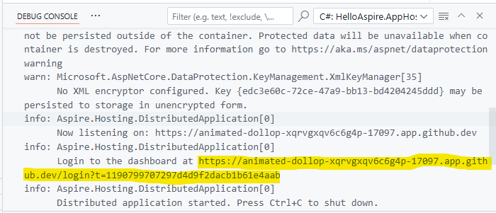

# .NET Aspire and GitHub Codespaces

[GitHub Codespaces](https://github.com/features/codespaces) offers a cloud-hosted development environment based on Visual Studio Code. It can be accessed directly from a web browser or through Visual Studio Code locally, where Visual Studio Code acts as a client connecting to a cloud-hosted backend. With .NET Aspire 9.1, comes logic to better support GitHub Codespaces including:

- Automatically configure port forwarding with the correct protocol.
- Automatically translate URLs in the .NET Aspire dashboard.

Prior to .NET Aspire 9.1 it was still possible to use .NET Aspire within a GitHub Codespace, however more manual configuration was required.

## GitHub Codespaces vs. Devcontainers

GitHub Codespaces builds upon Visual Studio Code and the [Devcontainers specification](https://containers.dev/implementors/spec/). In addition to supporting GitHub Codespaces, .NET Aspire 9.1 enhances support for using Visual Studio Code and locally hosted Devcontainers. While the experiences are similar, there are some differences. For more information, see [.NET Aspire with Devcontainers in Visual Studio Code](devcontainers.md).

## Quick start using template repository

To configure GitHub Codespaces for .NET Aspire, use the _.devcontainer/devcontainer.json_ file in your repository. The simplest way to get started is by creating a new repository from our [template repository](https://github.com/dotnet/aspire-devcontainer). Consider the following steps:

1. [Create a new repository](https://github.com/new?template_name=aspire-devcontainer&template_owner=dotnet) using our template.


Once you provide the details and click _Create repository_ the repository will be created and you will be shown the repository in GitHub.

2. From the new repository click on the Code button and select the Codespaces tab and then click _Create codespace on main_.


Once you click on this button you will be navigate to a web-based version of Visual Studio Code. Before using the Codespace the containerized development environment needs to be prepared. This process happens automatically on the server and you can review progress by clicking on the _Building codespace_ link in the notification in the bottom right of the browser window.


Once the container image has finished being built the _Terminal_ prompt appears which signals that the environment is ready to be interacted with.


At this point the .NET Aspire templates have been pre-installed and the ASP.NET Core developer certificate has been pre-configured.

3. Create a new .NET Aspire project using the starter template.

```dotnetcli
dotnet new aspire-starter --name HelloAspire
```

This will result in a number of files and folders being created in the repository which will be visible in the _Explorer_ panel on the left hand side of the window.


4. Launch the app host via the `HelloAspire.AppHost/Program.cs` file.


After a few moments the _Debug Console_ panel will become visible and it will show a link to the .NET Aspire dashboard exposed on a GitHub Codespaces endpoint with the authentication token.



5. Open the .NET Aspire dashboard by clicking on the dashboard URL in the debug console. This will cause the .NET Aspire dashboard to be opened in a separate tab within your browser.

Notice in the dashboard that all HTTP/HTTPS endpoints defined on resources have had their typical `localhost` address translated to a unique fully qualified domain on the `app.github.dev` domain.


Traffic to each of these endpoints will be automatically forwarded to the underlying process or container running within the Codespace. This includes development time tools such as as PGAdmin and Redis Insight.

> NOTE: In addition to the authentication token embedded within the URL of the dashboard link of the _Debug Console_, endpoints also require authentication via your GitHub identity to avoid port forwarded endpoints being accessible to everyone. For more information on port forwarding in GitHub Codespaces see [Forwarding ports in your codespace](https://docs.github.com/en/codespaces/developing-in-a-codespace/forwarding-ports-in-your-codespace?tool=webui).

6. Commit changes to the GitHub repository.

GitHub Codespaces does not automatically commit changes you make in the Codespace to the branch you are working on in GitHub. Use the Source Control panel to stage and commit the changes and push them back to the repository.

Working in a GitHub Codespace is very similar to working with Visual Studio Code on your own PC. You can checkout different branches and push changes just like you normally would. In addition you can easily spin up multiple Codespaces simultaneously if you want to quickly work on another branch without disrumpting your existing debug session. See [Developing in a codespace](https://docs.github.com/en/codespaces/developing-in-a-codespace/developing-in-a-codespace?tool=webui) for more information.

7. Cleaning up your codespace

GitHub Codespaces are temporary development environments and whilst you might use one for an extended period of time they should be considered a disposable resource that you recreate when you need it (with all of the customization/setup contained within `devcontainer.json` and associated configuration files).

To delete your GitHub Codespace visit the GitHub Codespaces page. This will show you a list of all of your codespaces. From here you can perform management operations on each Codespace including deleting them.

GitHub charges for the use of Codespaces. For more information see [Managing the cost of GitHub Codespaces in your organization](https://docs.github.com/en/codespaces/managing-codespaces-for-your-organization/choosing-who-owns-and-pays-for-codespaces-in-your-organization).

> NOTE: .NET Aspire supports the use of Devcontainers in Visual Studio Code indepent of GitHub Codespaces. For more information on how to use Devcontainers locally see [.NET Aspire and Devcontainers in Visual Studio Code](devcontainers.md).

## Manually configuring `devcontainer.json`

The above walkthrough shows the streamlined process of creating a GitHub Codespace using the .NET Aspire Devcontainer template. If you already have a repository established and want to start using Devcontainer functionality in .NET Aspire with that then you just need to add a `devcontainer.json` file to the `.devcontainer` folder within your repository.

The template repository contains a copy of the `devcontainer.json` file that you can use as a starting point which should be sufficient for .NET Aspire. Here is a snapshot of that file for reference (be sure to check the [template repository](https://github.com/dotnet/aspire-devcontainer) for the latest version):

```json
{
	"name": ".NET Aspire",
	"image": "mcr.microsoft.com/devcontainers/dotnet:dev-9.0-bookworm",
	"features": {
		"ghcr.io/devcontainers/features/azure-cli:1": {},
		"ghcr.io/devcontainers/features/docker-in-docker:2": {},
		"ghcr.io/devcontainers/features/powershell:1": {},
		"ghcr.io/azure/azure-dev/azd:0": {}
	},

	"hostRequirements": {
		"cpus": 8,
		"memory": "32gb",
		"storage": "64gb"
	},

	"onCreateCommand": "dotnet new install Aspire.ProjectTemplates::9.1.0 --force",
	"postStartCommand": "dotnet dev-certs https --trust",
	"customizations": {
		"vscode": {
			"extensions": [
				"ms-dotnettools.csdevkit",
				"ms-azuretools.vscode-bicep",
				"ms-azuretools.azure-dev",
				"GitHub.copilot-chat",
				"GitHub.copilot"
			]
		}
	}
}
```

## Speeding up Codespace creation

Creating a GitHub Codespace can take some time to prepare the underlying container image. To speed this process up it is possible to _pre-build_ the container images to reduce creation time to a 30-60 seconds (time varies). For more information about GitHub Codespaces pre-builds see [About GitHub Codespaces prebuilds](https://docs.github.com/en/codespaces/prebuilding-your-codespaces/about-github-codespaces-prebuilds).

