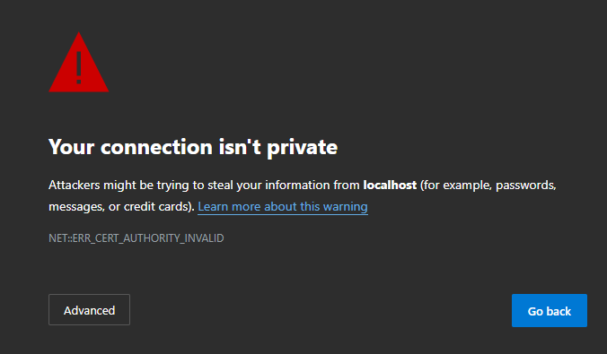

# .NET Aspire and Visual Studio Code Dev Containers

The [Dev Containers Visual Studio Code extension](https://marketplace.visualstudio.com/items?itemName=ms-vscode-remote.remote-containers) provides a way for development teams to develop within a containerized environment where all dependencies are preconfigured. With .NET Aspire 9.1, there's added logic to better support working with .NET Aspire within a Devcontainer environment by automatically configuring port forwarding.

Prior to .NET Aspire 9.1 it was still possible to use .NET Aspire within a Devcontainer, however more manual configuration was required.

## Dev Containers vs. GitHub Codespaces

Using Dev Containers in Visual Studio Code is quite similar to using GitHub Codespaces. With the release of .NET Aspire 9.1, support for both Dev Containers in Visual Studio Code and GitHub Codespaces has been enhanced. Although the experiences are similar, there are some differences. For more information on using .NET Aspire with GitHub Codespaces, see [.NET Aspire and GitHub Codespaces](codespaces.md).

## Quick start using template repository

To configure Devcontainers in Visual Studio Code, use the _.devcontainer/devcontainer.json file in your repository. The simplest way to get started is by creating a new repository from our [template repository](https://github.com/dotnet/aspire-devcontainer). Consider the following steps:

1. [Create a new repository](https://github.com/new?template_name=aspire-devcontainer&template_owner=dotnet) using our template.

    :::image source="media/new-repository-from-template.png" lightbox="media/new-repository-from-template.png" alt-text="Create new repository.":::

    Once you provide the details and select **Create repository**, the repository is created and shown in GitHub.

2. Clone the repository to your local developer workstation using the following command:

```dotnetcli
git clone https://github.com/<org/username>/<repository>
```

3. Open the repository in Visual Studio Code. After a few moments Visual Studio Code will detect the _.devcontainer/devcontainer.json_ file and prompt to open the repository inside a container. Select whichever option is most appropriate for your workflow.


After a few moments the list of files will become visible and the local build of the dev container will be completed.


4. Open a new terminal window in VSCode (``` CTRL-SHIFT-` ```) and create a new .NET Aspire project using the `dotnet` command-line.

```dotnetcli
dotnet new aspire-starter -n HelloAspire
```

After a few moments the project will be created and initial dependencies restored.

5. Open the `ProjectName.AppHost/Program.cs` file in the editor and click the run button on the top right hand corner of the editor window.


Visual Studio Code will build and start the .NET Aspire AppHost and will automatically open the .NET Aspire Dashboard. Because the endpoints hosted in the container are using a self-signed certificate the first time you access an endpoint for a specific devcontainer you will be presented with a certificate error.



This is expected. Once you have confirmed that the URL being requested corresponds to the dashboard in the Devcontainer you can ignore this warning.


.NET Aspire will automatically configure forwarded ports so that when you click on the endpoints in the .NET Aspire dashboard they will be tunneled to processes and nested containers within the Devcontainer.

6. Commit changes to the GitHub repository

Once you have successfully created the .NET Aspire project and verified that it launches and you can access the dashboard it is a good idea to commit the changes to the repository.

## Manually configuring _devcontainer.json_

The preceding walkthrough demonstrates the streamlined process of creating a Devcontainer using the .NET Aspire Devcontainer template. If you already have an existing repository and wish to utilize Devcontainer functionality with .NET Aspire, add a _devcontainer.json_ file to the _.devcontainer_ folder within your repository:

```Directory
└───📂 .devcontainer
     └─── devcontainer.json
```

The [template repository](https://github.com/dotnet/aspire-devcontainer) contains a copy of the _devcontainer.json_ file that you can use as a starting point, which should be sufficient for .NET Aspire. The following JSON represents the latest version of the _.devcontainer/devcontainer.json_ file from the template:

<!-- 
When https://github.com/dotnet/aspire-devcontainer is public, add the following JSON to the openpublishing.publish.config.json file:

```json
    {
      "path_to_root": "aspire-devcontainer",
      "url": "https://github.com/dotnet/aspire-devcontainer",
      "branch": "main",
      "branch_mapping": {}
    },
```

And use this instead of the hardcoded JSON below:

:::code language="json" source="~/aspire-devcontainer/.devcontainer/devcontainer.json":::

-->

```json
// For format details, see https://aka.ms/devcontainer.json. For config options, see the
// README at: https://github.com/devcontainers/templates/tree/main/src/dotnet
{
    "name": ".NET Aspire",
    // Or use a Dockerfile or Docker Compose file. More info: https://containers.dev/guide/dockerfile
    "image": "mcr.microsoft.com/devcontainers/dotnet:9.0-bookworm",
    "features": {
        "ghcr.io/devcontainers/features/azure-cli:1": {},
        "ghcr.io/devcontainers/features/docker-in-docker:2": {},
        "ghcr.io/devcontainers/features/powershell:1": {},
        "ghcr.io/azure/azure-dev/azd:0": {}
    },

    "hostRequirements": {
        "cpus": 8,
        "memory": "32gb",
        "storage": "64gb"
    },

    // Use 'forwardPorts' to make a list of ports inside the container available locally.
    // "forwardPorts": [5000, 5001],
    // "portsAttributes": {
    //        "5001": {
    //            "protocol": "https"
    //        }
    // }

    // Use 'postCreateCommand' to run commands after the container is created.
    // "postCreateCommand": "dotnet restore",
    "onCreateCommand": "dotnet new install Aspire.ProjectTemplates::9.0.0 --force",
    "postStartCommand": "dotnet dev-certs https --trust",
    "customizations": {
        "vscode": {
            "extensions": [
                "ms-dotnettools.csdevkit",
                "ms-azuretools.vscode-bicep",
                "ms-azuretools.azure-dev",
                "GitHub.copilot-chat",
                "GitHub.copilot"
            ]
        }
    }
    // Configure tool-specific properties.
    // "customizations": {},

    // Uncomment to connect as root instead. More info: https://aka.ms/dev-containers-non-root.
    // "remoteUser": "root"
}
```