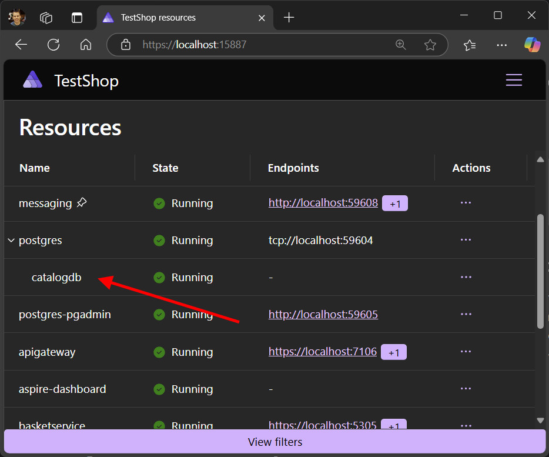

# What's new in .NET Aspire 9.1

📢 .NET Aspire 9.1 is the next minor version release of .NET Aspire; it supports _both_:

- .NET 8.0 Long Term Support (LTS) _or_
- .NET 9.0 Standard Term Support (STS).

> [!NOTE]
> You're able to use .NET Aspire 9.1 with either .NET 8 or .NET 9!

As always, we focused on highly requested features and pain points from the community. Our theme for 9.1 was "polish, polish, polish" - so you'll see quality of life fixes throughout the whole platform! Some highlights from this release are resource relationships in the dashboard, support for working in GitHub Codespaces, and publishing resources as a Dockerfile.

If you have feedback, questions, or want to contribute to .NET Aspire, collaborate with us on [:::image type="icon" source="../media/github-mark.svg" border="false"::: GitHub](https://github.com/dotnet/aspire) or join us on [:::image type="icon" source="../media/discord-icon.svg" border="false"::: Discord](https://discord.com/invite/h87kDAHQgJ) to chat with team members.

For more information on the official .NET version and .NET Aspire version support, see:

- [.NET support policy](https://dotnet.microsoft.com/platform/support/policy): Definitions for LTS and STS.
- [.NET Aspire support policy](https://dotnet.microsoft.com/platform/support/policy/aspire): Important unique product life cycle details.

## Upgrade to 9.1

Moving between minor releases of .NET Aspire is simple:

1. In your app host project file (ie, MyApp.AppHost.csproj), update the Aspire.AppHost.Sdk version to 9.1.0
`<Sdk Name="Aspire.AppHost.Sdk" Version="9.1.0" />`
1. Check for any NuGet package updates, either using the NuGet Package Manager in Visual Studio or the "Update NuGet Package" command in VS Code.
1. Update to the latest .NET Aspire templates by running `dotnet new update` in the command line.

If your project file doesn't have `Aspire.AppHost.Sdk`, you might still be using .NET Aspire 8. To upgrade to 9.1, you can follow [the documentation from last release](../get-started/upgrade-to-aspire-9).

## Dashboard UX and customization

### Resource relationships

The dashboard now has the concept of a "parent" and "child" resource. For example, if you create a Postgres instance with multiple databases, they'll now be nested in the Resource page in the same instance.

### Localization overrides

The dashboard defaults to the language that your browser is in. In this release, we added the ability to override that and change the language the dashboard is in separately from the browser language.

### Filtering

You can now filter what you see in the Resource view by type, state, and health status.

### More resource details

When you click on a resource in the dashboard, more data now appears in the details pane, including references, back references, and volumes with their mount types.

### CORS support for custom local domains

You can now set the `DOTNET_DASHBOARD_CORS_ALLOWED_ORIGINS` environment variable to allow the dashboard to receive telemetry from other browser apps, such as if you have resources running on custom localhost domains.

### Flexibility with console logs

The console log page has two new options. You're now able to download your logs so you can view them in your own diagnostics tools. Plus, you can turn timestamps on or off to reduce visual clutter when needed.

### Various UX improvements

There are a bunch of new features in 9.1 that streamline and polish popular tasks, including:

- Resource commands, such as Start/Stop buttons, now also appears on the console logs page
- Single click to open in text visualizer
- URLs are automatically clickable, and there are no more commas separating endpoints

...and, most importantly, your scroll position now resets when you click between different resources 🥳

There are many more small tweaks that add up to a smoother dashboard experience - for some others, you can check out [James Newton-King](https://bsky.app/profile/james.newtonking.com) on Bluesky, who has been posting new dashboard features daily for the last few weeks!

## Local dev

### Start resources on demand

You can now tell resources not to start with the rest of your app by using `WithExplicitStart()` on the resource in your app host. Then, you can start it whenever you're ready from inside the dashboard.

### Better Docker integration

We added the ability to `PublishAsDockerfile()` for any projects and executable resources. This enables full customization of the docker container and docker file used in publish mode.

### Cleaning up Docker networks

We fixed [an annoying bug](https://github.com/dotnet/aspire/issues/6504) in 9.1 where Docker networks created by Aspire would stay alive even after you stopped running the app. We now clean up after ourselves!

## Integrations

### Azure CosmosDB, SignalR, Functions, and more

We did a lot of work this release to improve various Azure integrations:

- CosmosDB now supports Microsoft Entra ID for authentication
  - Support for the [vnext-preview emulator](/azure/cosmos-db/emulator-linux)
- Service Bus and SignalR resources now let you `RunAsEmulator()`
- It's much simpler to connect to existing Azure resources in the app host
- Experimental support for configuring custom domains in Azure Container Apps.

### Even more integration updates

 - Microsoft.Extensions.AI is now supported in OpenAI
 - RabbitMQ was updated to v7, and MongoDB was updated to v3.
 - Dapr has migrated to the [CommunityToolkit](https://github.com/CommunityToolkit/Aspire/tree/main/src/CommunityToolkit.Aspire.Hosting.Dapr) to allow it to innovate faster.
 - Many other integrations got updates, fixes, and new features. Check out our [GitHub release](https://github.com/dotnet/aspire/releases) for details and more!

## Deployment

We continued improving the Azure Container Apps deployment story, both in azd and with app host options. One top requested feature - allowing npm apps to deploy to ACA like other resources - is now supported!

## Upgrade today

Follow the directions above to make the switch to 9.1 and take advantage of all these new features today! As always, we'll be listening for your feedback on [GitHub](https://github.com/dotnet/aspire/issues) - and looking out for what you want to see in 9.2 ☺️
