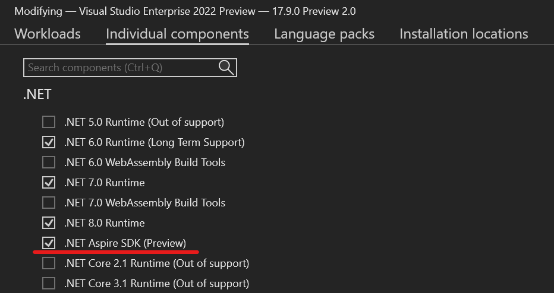

# .NET Aspire preview 3

This article covers the 3rd preview of .NET Aspire. While the goal is to have monthly releases, January was skipped due to the holidays. .NET Aspire **preview 3** is now available!

## Get .NET Aspire preview 3

The complete set of [.NET Aspire setup and tooling](../fundamentals/setup-tooling.md) instructions has been updated to reflect preview 3. The following are the key steps to get started with preview 3:

1. If on Windows and using Visual Studio to work with .NET Aspire, install/update to the latest [Visual Studio 2022 Preview](https://aka.ms/vspreview) release (17.10.0 Preview 1.0 at the time of writing).

    - Ensure that the **.NET Aspire SDK (Preview)** component is selected under the **Individual components** tab of the Visual Studio installer:

    

1. If on Windows and you have Visual Studio 2022 17.8.x installed but intend to only use .NET Aspire via the .NET CLI (`dotnet`), download and install the [.NET 8.0.100 SDK using the standalone installer](https://dotnet.microsoft.com/download/dotnet/8.0).

1. If on macOS or Linux, download and install the [.NET 8.0.100 SDK](https://dotnet.microsoft.com/download/dotnet/8.0).

1. From a terminal, run the following commands to update the .NET Aspire workload:

    ```dotnetcli
    dotnet workload update
    dotnet workload install aspire
    ```

After updating run `dotnet workload list` to see the updated version (your version of Visual Studio may differ):

```dotnetcli
dotnet workload list

Installed Workload Id    Manifest Version                    Installation Source
--------------------------------------------------------------------------------------------
aspire                   8.0.0-preview.3.24105.21/8.0.100    SDK 8.0.100, VS 17.10.34608.216
```

### Update existing apps

For existing .NET Aspire apps, after installing the latest workload, update all .NET Aspire package references to:

- `8.0.0-preview.3.24105.21`

For example, package references in your `.csproj` file for `Aspire.Hosting` should be updated to:

```xml
<PackageReference Include="Aspire.Hosting" Version="8.0.0-preview.3.24105.21" />
```

If you're using Visual Studio, use the NuGet Package Manager to update all packages for the solution. Ensure that the pre-release checkbox is checked.

### API changes

There are several hosting API changes in preview 3:

- In existing code, `builder.WithServiceBinding(...)` should now be changed to `builder.WithEndpoint(...)` to retain the same behavior (there are similar changes for other resource types as well). The `WithServiceBinding` API has been obsoleted, while it will continue to work with a compile warning, you should update it before it's removed in the next preview.

For more information on API changes, see [Breaking changes and new APIs](#breaking-changes-and-new-apis).

## Dashboard updates and refactoring

The [.NET Aspire Dashboard](../fundamentals/dashboard.md) has undergone a lot of refactoring, splitting it out into its own independent component. The dashboard used to be run as part of the host project, and that caused version conflicts between the dashboard and project dependencies. The dashboard is now its own independent executable, that communicates via gRPC to an endpoint to retrieve information about the projects, containers, their status and logs.

This refactoring enables the dashboard to be more easily used for real-time runtime diagnostics after deployment, as hosts can implement the same gRPC contract/endpoint for project and dependency status.

Refactoring shouldn't require any changes to .NET Aspire projects as there have been no related API changes for the projects themselves. Using the dashboard is unchanged in your development environment.

### Localization and accessibility

Many small changes across the dashboard have been made to support localization and accessibility. These changes include improving color contrast, adding accessibility attributes, and moving UI text into resource files.

An example of an improvement is how the dashboard indicates trace length. Previously there was a subtle color gradient on each row that didn't meet accessibility requirements. In preview 3 this was replaced with a radial progress icon:

:::image type="content" source="media/preview-3/trace-duration.png" lightbox="media/preview-3/trace-duration.png" alt-text="Trace details page with new radial icon used to quickly differentiate trace lengths.":::

### New resource details view

The resources page grid previously displayed an overload of information. Preview 3 now includes a resource details view for improved readability. The grid continues to display important information, while the details view shows additional data, including all of the resource's properties.

:::image type="content" source="media/preview-3/resource-details-view.png" lightbox="media/preview-3/resource-details-view.png" alt-text="Resource details view.":::

### Telemetry improvements

The dashboard telemetry pages show off a number of improvements:

- **Metrics filter UI**: The metrics filter UI has been redesigned. It's now much faster to update filters when viewing a metrics chart.
- **Histogram metrics count**: There is a new option to view the count of items recorded to a histogram metric.
- **Span events**: OpenTelemetry spans support events. For example, when was the first data received during a database call. Events are available in span details view.

## Component updates

[.NET Aspire components](../fundamentals/components-overview.md) are a curated suite of NuGet packages specifically selected to facilitate the integration of cloud-native applications with prominent services and platforms. Each component furnishes essential cloud-native functionalities through either automatic provisioning or standardized configuration patterns. .NET Aspire components can be used without an orchestrator project, but they're designed to work best with the .NET Aspire app host.

### Azure AI OpenAI component

This component enables integration of the Azure AI OpenAI or OpenAI services from a .NET Aspire project. Assuming you already have an OpenAI service provisioned, you can use OpenAI from your projects.

- [Aspire.Azure.AI.OpenAI](https://www.nuget.org/packages/Aspire.Azure.AI.OpenAI) NuGet 📦 package.

```csharp
using Azure.AI.OpenAI;

var builder = WebApplication.CreateBuilder(args);

// Add service defaults and components.
builder.AddServiceDefaults();
builder.AddAzureOpenAI("OpenAI");

var app = builder.Build();

app.MapGet("/chat", static async (string request, OpenAIClient client) =>
{
    var options = new ChatCompletionsOptions(
        "gpt-35-turbo", [new ChatRequestUserMessage(request)]);

    var response = await client.GetChatCompletionsAsync(options);

    return response.Value.Choices.FirstOrDefault()?.Message.Content
        ?? "no response...";
});

app.MapDefaultEndpoints();

app.Run();
```

For more information, see [GitHub: .NET Aspire.Azure.AI.OpenAI](https://github.com/dotnet/aspire/tree/main/src/Components/Aspire.Azure.AI.OpenAI).

### Component and hosting for Apache Kafka

[Guillaume Delahaye (@g7eg6e)](https://github.com/g7ed6e) contributed a library that wraps `Confluent.Kafka` binaries for producing and consuming messages to an Apache Kafka broker. The .NET Aspire integration enables corresponding health checks, logging and metrics.

- [Aspire.Confluent.Kafka](https://www.nuget.org/packages/Aspire.Confluent.Kafka) NuGet 📦 package.

Consider the following example:

```csharp
var builder = WebApplication.CreateBuilder(args);

// Add service defaults and components.
builder.AddServiceDefaults();
builder.AddKafkaProducer<string, string>("kafka");

var app = builder.Build();

app.MapGet("/produce/{message}", static async (
    IProducer<string, string> producer, string message) =>
{
    await producer.ProduceAsync(
        "my-topic",
        new Message<string, string>()
        {
            Key = Guid.NewGuid().ToString(),
            Value = message
        });
});

app.MapDefaultEndpoints();

app.Run();
```

In addition, `Aspire.Hosting` support for Apache Kafka resources has been added, making it easy to spin up an Apache Kafka container for local development.

```csharp
var builder = DistributedApplication.CreateBuilder(args);

var messaging = builder.AddKafka("kafka");
```

For more information, see [GitHub: .NET Aspire.Confluent.Kafka](https://github.com/dotnet/aspire/tree/main/src/Components/Aspire.Confluent.Kafka).

### Component for Oracle with EF

A community contribution from [Andre Vieira (@andrevlins)](https://github.com/andrevlins), this provides integration of the Oracle Entity Framework provider into Aspire, enabling connection pooling, health check, logging and telemetry.

- [Aspire.Oracle.EntityFrameworkCore](https://www.nuget.org/packages/Aspire.Oracle.EntityFrameworkCore) NuGet 📦 package.

```csharp
var builder = WebApplication.CreateBuilder(args);

// Add service defaults and components.
builder.AddServiceDefaults();
builder.AddOracleDatabaseDbContext<CatalogDbContext>("catalog");

var app = builder.Build();

app.MapGet("items", static async (CatalogDbContext context) =>
{
    return await catalogDbContext.CatalogItems;
});

app.MapDefaultEndpoints();

app.Run();
```

In addition, `Aspire.Hosting` support for Oracle resources has been added, making it easier than ever to spin up an Oracle container for local development, or connect to an existing Oracle instance.

```csharp
var builder = DistributedApplication.CreateBuilder(args);

var catalogDb = builder.AddOracleDatabase("oracledatabase")
                       .AddDatabase("catalog");
```

For more information, see [GitHub: .NET Aspire.Oracle.EntityFrameworkCore](https://github.com/dotnet/aspire/tree/main/src/Components/Aspire.Oracle.EntityFrameworkCore).

### Component and hosting for MySql with EF

[Bradley Grainger (@bgrainger)](https://github.com/bgrainger) has contributed an Aspire component for MySQL named `Aspire.Pomelo.EntityFrameworkCore.MySql`. This wraps the `Pomelo.EntityFrameworkCore.MySql` library which is an Entity Framework Core provider for MySQL compatible databases. It supports EF Core up to its latest version and uses MySqlConnector for high-performance database server communication. The Aspire integration enables connection pooling, health check, logging and telemetry.

- [Aspire.Pomelo.EntityFrameworkCore.MySql](https://www.nuget.org/packages/Aspire.Pomelo.EntityFrameworkCore.MySql) NuGet 📦 package.

```csharp
var builder = WebApplication.CreateBuilder(args);

// Add service defaults and components.
builder.AddServiceDefaults();
builder.AddMySqlDbContext<CatalogDbContext>("catalog");

var app = builder.Build();

app.MapGet("items", static async (CatalogDbContext context) =>
{
    return await catalogDbContext.CatalogItems;
});

app.MapDefaultEndpoints();

app.Run();
```

You can use the existing `Aspire.Hosting` support for MySQL resources to spin up a MySQL container for local development, or connect to an existing MySQL instance.

```csharp
var builder = DistributedApplication.CreateBuilder(args);

var catalogDb = builder.AddMySql("mysql")
    // Mount the SQL scripts directory into the 
    // container so that the init scripts run.
    .WithVolumeMount(
        source: "../DatabaseContainers.ApiService/data/mysql",
        target: "/docker-entrypoint-initdb.d",
        type: VolumeMountType.Bind)
    .AddDatabase("catalog");
```

For more information, see [GitHub: .NET Aspire.Pomelo.EntityFrameworkCore.MySql](https://github.com/dotnet/aspire/tree/main/src/Components/Aspire.Pomelo.EntityFrameworkCore.MySql).

### Hosting support for CosmosDB

As part of preview 3 support for provisioning Cosmos DB resources was introduced. To use Cosmos DB in your app host you can do the following:

```csharp
var builder = DistributedApplication.CreateBuilder(args);

var db = builder.AddAzureCosmosDB("cosmos")
                .UseEmulator()
                .AddDatabase("db");

var app = builder.AddProject<Projects.MyApp("app");
```

Inside the entrypoint for the application code you can wire up the Cosmos DB client using the following:

```csharp
builder.AddAzureCosmosDB("db", static settings =>
{
    settings.IgnoreEmulatorCertificate = true;
});
```

When using the Cosmos DB emulator, you can ignore the certificate validation by setting the `IgnoreEmulatorCertificate` property to `true`. We are currently working with the Cosmos team to remove the need to set `IgnoreEmulatorCertificate` so this customization for settings may not be required in the future.

When deployed, `azd` will automatically provision the Cosmos DB resource and create the database as defined in the .NET Aspire application model.

### `StackExchange.Redis` now has logging

We've updated the Aspire component to use the new feature in `StackExchange.Redis` which supports <xref:Microsoft.Extensions.Logging.ILogger>. Redis logs will now be shown in both the console and structured logs in the dashboard.

## Breaking changes and new APIs

The following sections detail several breaking changes in preview 3. Additionally, several new APIs are introduced in this release.

### `WithServiceBinding` has changed to `WithEndpoint`

The `WithServiceBinding` API was a little unclear as to what it actually did. The API has been deprecated and replaced with `WithEndpoint`. Additional variants for `WithHttpEndpoint` and `WithHttpsEndpoint` that are parameterized for those connection types have been added.

```csharp
// This will launch the Grafana container image and bind it to a random 
// port (visible in the Dashboard). 
var builder = DistributedApplication.CreateBuilder(args);

var container = builder.AddContainer("grafana", "grafana/grafana")
                       .WithHttpEndpoint(3000);

builder.Build().Run();
```

### `WithEntrypoint` is now supported for containers

Using `WithEntrypoint` enables the entrypoint to be specified for container based resources.

### RedisCommander resource extension

[Redis commander](https://github.com/joeferner/redis-commander) is a web management tool for viewing the contents of the Redis Cache. With this change you can use the `WithRedisCommander` extension to both `IResourceBuilder<RedisResource>` and `IResourceBuilder<RedisContainerResource>` which results in a container resource being added to the model (once) and a lifecycle hook which configures it for Redis Commander.

Once added, when run a pre-configured Redis Commander instance is spun up to interactively browse what is in the Redis Cache. It can be accessed via the Aspire Dashboard. For example:

```csharp
var builder = DistributedApplication.CreateBuilder(args);

builder.AddRedis("myredis1").WithRedisCommander();

builder.AddRedis("myredis2").WithRedisCommander();
```

### PostgreSQL PgAdmin resource extension

[Andre Vieira (@andrevlins)](https://github.com/andrevlins) has also contributed a resource extension to make it easier to deploy the [pgAdmin](https://www.pgadmin.org/) container to manage your PostgreSQL database instances. Similar to the RedisCommander functionality above, this makes it easy to automatically deploy a pgadmin container when running an Aspire project.

```csharp
var builder = DistributedApplication.CreateBuilder(args);

var catalogDb = builder.AddPostgres("postgres")
                       .WithPgAdmin()
                       .AddDatabase("catalogdb");
```

### Model Dapr sidecar as an Aspire resource

Previously Dapr sidecars were modeled as annotations on a parent resource, which indicated the need for a Dapr sidecar started for that resource. The App Model has been extended so that the Dapr sidecar is a _true_ resource, but one exposed _only_ through the existing `AddDaprSidecar` API to avoid semantic errors; users cannot create an arbitrary Dapr sidecar resource, only configure the one associated with a given resource. The API allows the existing sidecar options (if any) to be specified, as well as use the existing resource annotation helpers, such as <xref:Aspire.Hosting.ResourceBuilderExtensions.WithEnvironment%2A>.

```csharp
builder.AddProject<Projects.DaprServiceA>("servicea")
       .WithDaprSidecar(
            static sidecarBuilder =>
            {
                sidecarBuilder.WithOptions(new DaprSidecarOptions
                    {
                        // ...
                    })
                    .WithEnvironment("DAPR_TEST_VAR", "Dapr Test Value");
            });
```

### Add support for Dapr `--runtime-path` option

This change enables running Aspire applications with an arbitrary version of the Dapr runtime, such as when you want to test against a locally-built version of Dapr.

```csharp
builder.AddProject<Projects.DaprServiceB>("serviceb")
       .WithDaprSidecar(new DaprSidecarOptions
        {
            AppId = "serviceb",
            RuntimePath = "/some/other/runtime/folder"
        });
```

## Add support for Orleans in .NET Aspire

Preview 3 adds support for [Orleans](/dotnet/orleans/overview) v8.1.0-preview1 or later, allowing you to configure a cluster in your app host, specifying the resources the cluster uses. For example, you can specify that an Azure Table will be used for cluster membership, an Azure Redis resource will be used for the grain directory, and an Azure Blob Storage resource will be used to store grain state. The integration currently support Redis and Azure Table & Blob storage resources. Support for other resources will be added later.

In the app host project, an Orleans cluster can be declared using the `AddOrleans` method, and then configured with clustering, grain storage, grain directory, and other providers using methods on the returned builder:

```csharp
var storage = builder.AddAzureStorage("storage");
var clusteringTable = storage.AddTables("clustering");
var defaultStorage = storage.AddBlobs("grainstate");
var cartStorage = builder.AddRedis("redis-cart");

var orleans = builder.AddOrleans("my-app")
                     .WithClustering(clusteringTable)
                     .WithGrainStorage("Default", grainStorage)
                     .WithGrainStorage("cart", cartStorage);

// Add a server project (also called "silo")
builder.AddProject<Projects.OrleansServer>("silo")
       .WithReference(orleans);

// Add a project with a reference to the Orleans client
builder.AddProject<Projects.FrontEnd>("frontend")
       .WithReference(orleans);
```

In the client and server projects, add Orleans to the host builder as usual.

```csharp
// For an Orleans server:
builder.UseOrleans();

// Or, for an Orleans client:
builder.UseOrleansClient();
```

Orleans will read configuration created by your Aspire app host project and configure the providers specified therein. To allow Orleans to access the configured resources, add them as keyed services using the corresponding Aspire component:

```csharp
builder.AddKeyedAzureTableService("clustering");
builder.AddKeyedAzureBlobService("grainstate");
builder.AddKeyedRedis("redis-cart");
```

## New .NET Aspire samples

The .NET Aspire samples are located in <https://github.com/dotnet/aspire-samples>, not the main Aspire repo. New samples for preview 3 include:

- [AspireWithJavaScript](https://github.com/dotnet/aspire-samples/tree/main/samples/AspireWithJavaScript) demonstrates an approach for integrating several Node.js apps into a .NET Aspire application, including Angular, React, and Vue.
- [ClientAppsIntegration](https://github.com/dotnet/aspire-samples/tree/main/samples/ClientAppsIntegration) demonstrates working with client apps such as WinForms, WPF, etc., in a .NET Aspire app, such that the client app is launched along with the AppHost project, can resolve services via service discovery, and logs, traces, and metrics via OpenTelemetry to the dashboard.
- [Persistent Volume Mount](https://github.com/dotnet/aspire-samples/tree/main/samples/VolumeMount) demonstrates how to configure a SQL Server container to use a persistent volume mount in .NET Aspire, so that the data is persisted across app launches. This method can be used to persist data across instances of other container types configured in .NET Aspire apps too, e.g. PostgreSQL, Redis, etc.

## Deployment to Azure using `azd`

The [Azure Developer CLI (azd)](/azure/developer/azure-developer-cli/) is an open-source tool that makes it easier to get your applications running in the cloud on Azure. We are working to ensure that `azd` enables the fastest and simplest way to get an Aspire app provisioned and deployed to Azure in minutes. In this release the focus has still been primarily targeting Azure Container Apps.

In this release, new features to better support .NET Aspire deployments include:

- CosmosDB: For more information, see [Hosting support for CosmosDB](#hosting-support-for-cosmosdb).
- AzureSQL

```csharp
var azSqlServer = builder.AddAzureSqlServer("azsql").AddDatabase("azsqldb");
```

## Add templates for _AppHost_ and _ServiceDefaults_ projects

For those wishing to add .NET Aspire functionality to an existing solution, you can use the new templates for the _AppHost_ and _ServiceDefault_ projects. These are the same projects included in the empty .NET Aspire application template. They can be added through Visual Studio _Add New Project_ or via the command line using:

```console
dotnet new aspire-apphost
dotnet new aspire-servicedefaults
```

For more information on adding .NET Aspire to existing solutions, see [Tutorial: Add .NET Aspire to an existing .NET 8 microservices app](../get-started/add-aspire-existing-app.md).

## Summary

A new .NET Aspire preview release is planned every month leading up to a stable release anticipated in the second quarter of 2024.

- To get involved checkout the [.NET Aspire project on GitHub](https://github.com/dotnet/aspire).
- Follow along with the official samples in the [dotnet/aspire-samples repo](https://github.com/dotnet/aspire-samples).
