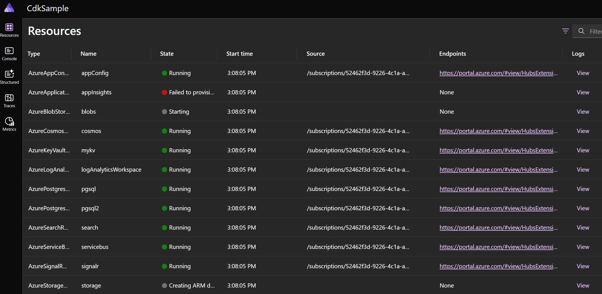

# .NET Aspire preview 5

## Packaging changes
As part of our journey to GA we have split up the `Aspire.Hosting` and `Aspire.Hosting.Azure` packages. These changes
will allow us greater flexibility for servicing and ensure that appropriate boundaries are maintained between our
core abstractions for .NET Aspire and various cloud-native dependencies that an application may require.

The following table maps between Aspire extension methods you might be using today in your AppHost and the package
in which they are now contained:

| Extension method | Package |
|-|-|
| `AddProject(...)` | `Aspire.Hosting` (unchanged) |
| `AddContainer(...)` | `Aspire.Hosting` (unchanged) |
| `AddExecutable(...)` | `Aspire.Hosting` (unchanged) |
| `AddKafka(...)` | `Aspire.Hosting.Kakfa` |
| `AddMongoDB(...)` | `Aspire.Hosting.MongoDB` |
| `AddMySql(...)` | `Aspire.Hosting.MySql` |
| `AddNpmApp(...)` | `Aspire.Hosting.NodeJs` |
| `AddNodeApp(...)` | `Aspire.Hosting.NodeJs` |
| `AddOracle(...)` | `Aspire.Hosting.Oracle` |
| `AddPostgres(...)` | `Aspire.Hosting.PostgreSQL` |
| `AddRabbitMQ(...)` | `Aspire.Hosting.RabbitMQ` |
| `AddRedis(...)` | `Aspire.Hosting.Redis` |
| `AddSeq(...)` | `Aspire.Hosting.Seq` |
| `AddSqlServer(...)` | `Aspire.Hosting.SqlServer` |

The `Aspire.Hosting.Azure` APIs have been broken up in to the following packages:

| Extension method | Package |
|-|-|
| `AddBicepTemplate(...)` | `Aspire.Hosting.Azure` (unchanged) |
| `AddBicepTemplateString(...)` | `Aspire.Hosting.Azure` (unchanged) |
| `AddAzureConstruct(...)` | `Aspire.Hosting.Azure` (unchanged) |
| `AddAzureAppConfiguration(...)` | `Aspire.Hosting.Azure.AppConfiguration` |
| `AddAzureApplicationInsights(...)` | `Aspire.Hosting.Azure.ApplicationInsights` |
| `AddAzureOpenAI(...)` | `Aspire.Hosting.Azure.CognitiveServices` |
| `AddAzureCosmosDB(...)` | `Aspire.Hosting.Azure.CosmosDB` |
| `AddAzureEventHubs(...)` | `Aspire.Hosting.Azure.EventHubs` |
| `AddAzureKeyVault(...)` | `Aspire.Hosting.Azure.KeyVault` |
| `AddAzureLogAnalyticsWorkspace(...)` | `Aspire.Hosting.Azure.OperationalInsights` |
| `AsAzurePostgresFlexibleServer(...)` | `Aspire.Hosting.Azure.PostgreSQL` |
| `AsAzureRedis(...)` | `Aspire.Hosting.Azure.Redis` |
| `AddAzureSearch(...)` | `Aspire.Hosting.Azure.Search` |
| `AddAzureServiceBus(...)` | `Aspire.Hosting.Azure.ServiceBus` |
| `AddAzureSignalR(...)` | `Aspire.Hosting.Azure.SignalR` |
| `AsAzureSqlDatabase(...)` | `Aspire.Hosting.Azure.Sql` |
| `AddAzureStorage(...)` | `Aspire.Hosting.Azure.Storage` |

# Application model changes

In addition to packaging changes some important changes were made to the application
model to allow for better integration between cloud-hosted resources and services that
are running locally.

For example resources that expose connection strings now have async methods instead
of synchronous methods which allow the start-up of a micro-service to block whilst
a cloud resource is being initialized.

A good illustration of the changes here can be seen on the `IResourceWithConnectiongString`
interface. The code below shows the preview 4 and preview 5 versions one after another.

```csharp
// Preview 4
public interface IResourceWithConnectionString : IResource
{
    string? GetConnectionString();
    string? ConnectionStringExpression => { get; }
    string ConnectionStringReferenceExpression { get; }
    string? ConnectionStringEnvironmentVariable { get; }
}

// Preview 5
public interface IResourceWithConnectionString :
    IResource, IManifestExpressionProvider, IValueProvider, IValueWithReferences
{
    ValueTask<string?> GetConnectionStringAsync(CancellationToken cancellationToken = default);
    string IManifestExpressionProvider.ValueExpression { get; }
    ValueTask<string?> IValueProvider.GetValueAsync(CancellationToken cancellationToken);
    ReferenceExpression ConnectionStringExpression { get; }
    string? ConnectionStringEnvironmentVariable { get; }
    IEnumerable<object> IValueWithReferences.References { get; }
}
```

The `GetConnectionString` method has been made asynchronous. But there are many other
properties that have been added. This allows for better tracking of dependencies
within the application model.

Note that the basic usage pattern for adding a reference from one resource to another
has not changed. The changes above primarily impact the internal implementation details
and only impact you if you are building custom resource types.

## Dashboard

In preview 5. our primary focus has been on non-functional requirements around security and performance improvements.

### Security Updates

Communication has been secured across the following endpoints:

- OTLP
- Dashboard
- Resource Server

#### OTLP endpoint security

The OTLP endpoint can be secured with [client certificate](/aspnet/core/security/authentication/certauth) or API key authentication.

- `Otlp:AuthMode` specifies the authentication mode on the OTLP endpoint. Possible values are `Certificate`, `ApiKey`, `Unsecured`. This configuration is required.
- `Otlp:ApiKey` specifies the API key for the OTLP endpoint when API key authentication is enabled. This configuration is required for API key authentication.

#### Dashboard authentication

The dashboard's web application frontend supports OpenID Connect (OIDC) for authentication. These can be applied via configurable settings, once Frontend:AuthMode is set to OpenIdConnect:

- `Authentication:Schemes:OpenIdConnect:Authority` &mdash; URL to the identity provider (IdP)
- `Authentication:Schemes:OpenIdConnect:ClientId` &mdash; Identity of the relying party (RP)
- `Authentication:Schemes:OpenIdConnect:ClientSecret`&mdash; A secret that only the real RP would know
- Other properties of [`OpenIdConnectOptions`](/dotnet/api/microsoft.aspnetcore.builder.openidconnectoptions) specified in configuration container `Authentication:Schemes:OpenIdConnect:*`
  
#### Resource server endpoint security

The resource server client supports client certificates. This can be applied via configurable settings, once ResourceServiceClient:AuthMode to Certificate

- `ResourceServiceClient:ClientCertificate:Source` (required) one of:
  - `File` to load the cert from a file path, configured with:
    - `ResourceServiceClient:ClientCertificate:FilePath` (required, string)
    - `ResourceServiceClient:ClientCertificate:Password` (optional, string)
  - `KeyStore` to load the cert from a key store, configured with:
    - `ResourceServiceClient:ClientCertificate:Subject` (required, string)
    - `ResourceServiceClient:ClientCertificate:KeyStore:Name` (optional, [`StoreName`](/dotnet/api/system.security.cryptography.x509certificates.storename), defaults to `My`)
    - `ResourceServiceClient:ClientCertificate:KeyStore:Location` (optional, [`StoreLocation`](/dotnet/api/system.security.cryptography.x509certificates.storelocation), defaults to `CurrentUser`)
- `ResourceServiceClient:Ssl` (optional, [`SslClientAuthenticationOptions`](/dotnet/api/system.net.security.sslclientauthenticationoptions))

### Performance improvements

- LOTS of performance improvements
  - Console log virtualization
  - Load time improvements
  - Trace ingestion improvements
- Run on a single port (OTLP and UI)
- Standalone container now forces you to choose auth

Templates

- HTTPs by default
- Test project support

AppModel

- Forwarded headers enabled by default for projects with endpoints
- Custom resources support in dashboard
  - Can publish notifications to the dashboard
  - Can log console output to the dashboard
- Built in methods for containers with well known volume mounts
- Add RabbitMQ WithManagementUI method.
- Applied consistent scheme for resources that support passwords
  - They can autogenerate passwords, or take parameters
- Support for composing environment variables using string interpolation
that can capture resource properties. (ReferenceExpression, WithEnvironment overload)

Service Discovery

- Service discovery API changes
- Service discovery auto scheme detection

Tooling

- VS Code support
- Prompting for parameters in Visual Studio

Components

- Azure Events Hubs
- Renamed all of the methods to end with *Client e.g. AddRedisClient
- Nats OpenTelemetry support

# Azure improvements

## Azure Provisioning libraries

In preview 5 the Azure-specific extensions for .NET Aspire have adopted the
Azure Provisioning libraries being developed by the Azure SDK team. The Azure
Provisioning libraries allow as to use a C# object model to declare Azure resources
and at deployment time translate that object model into Bicep which is then used
to automate deployment.

If you are already using Azure-based resources with your .NET Aspire application
the APIs you use today continue to work. For example the following code creates
an Azure Cosmos database and wires up the connection string to your application.

```csharp
var builder = DistributedApplication.CreateBuilder(args);
var cosmos = builder.AddAzureCosmosDB("mycosmos").AddDatabase("inventory");
builder.AddProject<Projects.InventoryApi>("inventoryapi")
                           .WithReference(cosmos);
```

In preview 4, if you didn't like the defaults that we specified for Azure Cosmos you
would need to provide your own Bicep and use the `AddBicepTemplate` extension. In
preview 5 we provide a callback mechanism which allows you to tweak properties.

For example, if you wanted to modify the consistency level of your Cosmos DB account
you could do the following:

```csharp
var builder = DistributedApplication.CreateBuilder(args);
var cosmos = builder.AddAzureCosmosDB(
    "mycosmos",
    (resource, construct, account, databases) => {
        
        account.AssignProperty(p => p.ConsistencyPolicy.DefaultConsistencyLevel, "`Session`");

    }).AddDatabase("inventory");
builder.AddProject<Projects.InventoryApi>("inventoryapi")
                           .WithReference(cosmos);
```

Azure Provisioning libraries are still experimental and evolving rapidly. Developers
are free to use them in their applications but expect the API surface to evolve
before reaching stability. To remind developers of this, using the overloads that
expose Azure Provisioning types will require the use of a code analysis suppression:

```csharp
var builder = DistributedApplication.CreateBuilder(args);
#pragma warning disable AZPROVISION001
var cosmos = builder.AddAzureCosmosDB(
    "mycosmos",
    (resource, construct, account, databases) => {
        
        account.AssignProperty(p => p.ConsistencyPolicy.DefaultConsistencyLevel, "`Session`");

    }).AddDatabase("inventory");
#pragma warning restore AZPROVISION001
builder.AddProject<Projects.InventoryApi>("inventoryapi")
                           .WithReference(cosmos);
```

This can be applied globally in your project or in a more localized way as shown above.

## Azure provisioning for local development

Previous .NET Aspire previews have had limited support for using cloud based resources for
local development. You could use an emulator (such as Azurite for Azure Storage)
or you could provision a real resource in the cloud and place a connection string in your AppHost's
user secrets.

In preview 5 if you want to use an Azure resource where an emulator does not exist you can add
the following settings to user `secrets.json` file:

```json
{
  "Azure": {
    "SubscriptionId": "<your azure subscription id>",
    "Location": "<default location>",
    "ResourceGroup": "<resource group name>"
  }
}
```

When you launch the AppHost the dashboard will show that it is create the Azure resources for you
and provide helpful links to the deployment into the Azure portal, or in the case of failure
logs that provide hints as to what might be causing the deployment issue.



To use Azure provisioning you only need to make use of one of an Azure resource. For example:

```csharp
var builder = DistributedApplication.CreateBuilder(args);
var blobs = builder.AzureStorage("storage").AddBlobs("blobs");
builder.AddProject<Projects.GalleryApp>("galleryapp")
                           .WithReference(blobs);
```

Some resources in .NET Aspire such as Postgres are not cloud specific and can run locally
in a container but when deployed use a managed service (such as Azure Postgres Flexible Server).

```csharp
var builder = DistributedApplication.CreateBuilder(args);
var db = builder.AddPostgres("pgsql")
                .PublishAsAzurePostgresFlexibleServer()
                .AddDatabase("inventorydb");
builder.AddProject<Projects.InventoryApi>("inventoryapi")
                           .WithReference(db);
```

It is also possible to use an Azure hosted resource for local development by using the
`AsAzurePostgresFlexibleServer()` extension method instead. When this method is used
the container will not be started locally and cloud-based instance will be created just
like the Azure only resource types. The `PublishAsX` and `AsX` methods also support callbacks
to customize the underlying Azure resources as shown above in the Cosmos DB example.

## Other Azure-related improvements

### Azure Open AI

The `AddAzureOpenAI(...)` extension method will now result in an Azure Open AI resource
being provisioned in Azure. This support was missing from preview 4 but was added in preview
5 as part of the overall improvements to Azure resource usage for local development mentioned
above.

```csharp
var openai = builder.AddAzureOpenAI("openai").AddDeployment(
    new("mydeployment", "gpt-35-turbo", "0613")
    );
```

> NOTE: Currently the Azure Open AI resource provider in Azure does not allow two model
>       deployments at the same time. If you want to deploy multiple models within your
>       application you will need to use separate Azure Open AI resources.

### Azure Event Hubs

Also in preview 5 we added support for Azure Event Hubs. You can add Azure Event Hubs to your
application model using the ```AddAzureEventHubs(...)` extension method. This will result in the
creation of an Event Hubs namespace. Use the `AddHub(...)` method.

```csharp
var builder = DistributedApplication.CreateBuilder(args);

// required for the event processor client which will use the connectionName to get the connectionString.
var blob = builder.AddAzureStorage("ehstorage")
    .AddBlobs("checkpoints");

var eventHub = builder.AddAzureEventHubs("eventhubns")
    .AddEventHub("hub");

builder.AddProject<Projects.EventHubsConsumer>("consumer")
    .WithReference(eventHub)
    .WithReference(blob);

builder.AddProject<Projects.EventHubsApi>("api")
    .WithExternalHttpEndpoints()
    .WithReference(eventHub);

builder.Build().Run();
```

As can be seen above the Event Hubs integration includes support for the Event Hubs processor architecture
not just the consumer model (although either can be used). Refer to the README for the `Aspire.Azure.Messaging.EventHubs`
package for examples of how to wire-up to the provisioned Event Hubs resource in your service projects.

Manifest

- Express container volumes and bindmounts in the manifest
- Support for multiple endpoints in the manifest
- Renamed containerPort to targetPort
- Added port as the "exposed port"

Azure Deployment

- Service selection prompt gone (WithExternalHttpEndpoints in apphost)
- Support for multiple endpoints in ACA
- Support for adding volumes to containers in ACA

- IDE protocol changes
- There's a new IDE protcol
